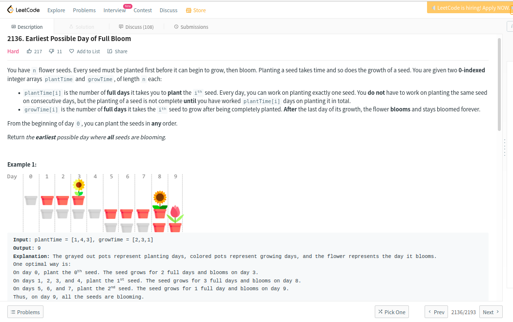
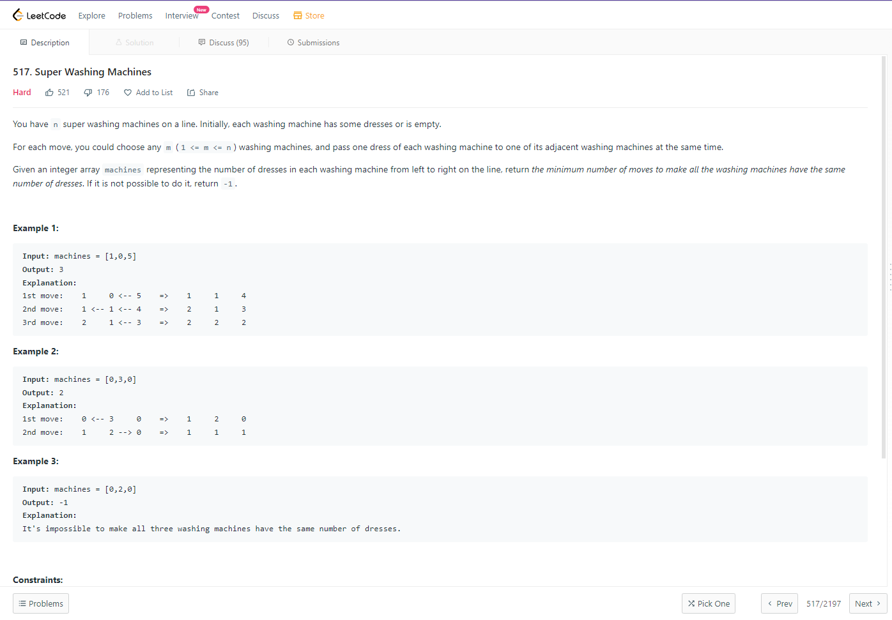
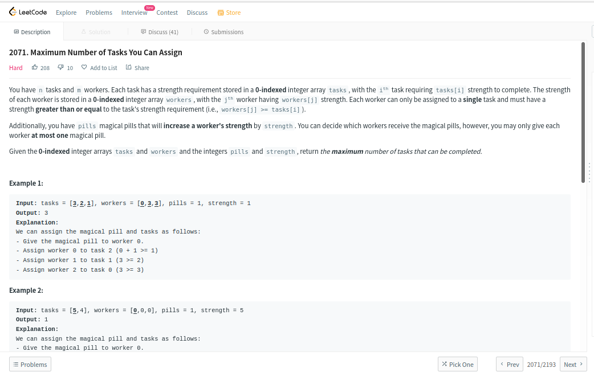
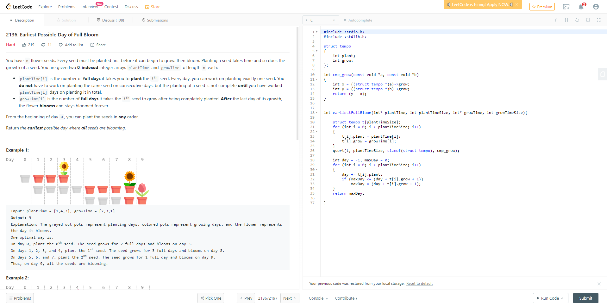

# Greed_Dupla25

**Número da Lista**: 3<br>
**Conteúdo da Disciplina**: Algoritmos ambiciosos<br>

## Alunos
|Matrícula | Aluno |
| -- | -- |
| 18/0101617  |  Guilherme de Morais Richter |
| 18/0102613  |  Ítalo Fernandes Sales de Serra |

## Apresentação

Faça o download do vídeo na pasta <b>apresentacao</b>.

Ou clique no link para assistir à apresentação no youtube: https://youtu.be/lB0jszmZikU

## Sobre 
Este projeto tem o objetivo de solucionar problemas de competição do nível <b>hard</b> do juiz online <b>LeetCode</b>.

Os problemas selecionados foram:

<b>1)</b> - Earliest possible day of full bloom - <b>hard</b> - link: https://leetcode.com/problems/earliest-possible-day-of-full-bloom/

<b>2)</b> - Super washing machines - <b>hard</b> - link: https://leetcode.com/problems/super-washing-machines/

<b>3)</b> - Maximum number of tasks you can assign - <b>hard</b> - link: https://leetcode.com/problems/maximum-number-of-tasks-you-can-assign/

## Screenshots

<b>Screenshot do problema Earliest possible day of full bloom.</b>


<b>Accepted do problema Earliest possible day of full bloom.</b>
Earliest_Possible_Day_of_Full_Bloom.png)

<b>Screenshot do problema Super washing machines.</b>


<b>Accepted do problema Super washing machines.</b>
Super_Washing_Machines.png)

<b>Screenshot de Maximum number of tasks you can assign.</b>


<b>Accepted de Maximum number of tasks you can assign.</b>
Maximum_Number_of_Tasks_You_Can_Assign.png)


## Instalação 

**Linguagem**: C e Python<br>
**Framework**: Não possui<br>

Para se ter os arquivos na sua máquina, é necessário seguir o seguinte passo:

- Clonar o nosso repositório do GitHub para a sua máquina, digitando no terminal (necessário ter o Git instalado):

```python
git clone https://github.com/projeto-de-algoritmos/Greed_Dupla25.git
```

Não é necessário instalar linguagem ou framework, pois os algoritmos podem ser executados em seu próprio juiz online de origem.

## Uso 

Como este projeto se trata de exercícios de um juiz online, ao entrar na página de cada problema, como por exemplo, a do Earliest possible day of full bloom (link: https://leetcode.com/problems/earliest-possible-day-of-full-bloom/), temos a seguinte interface:

<b>Exemplo de submissão.</b>


No exemplo acima, basta copiar o código-fonte do arquivo Earliest_Possible_Day_of_Full_Bloom.c, selecionar a linguagem que ele está escrito, no caso C, e em seguida clicar no botão Submit, no canto inferior direito.

Seguindo esse passo para os outros dois problemas, é possível verificar o funcionamento de todo o projeto.

## Outros 

Não há outras observações.
